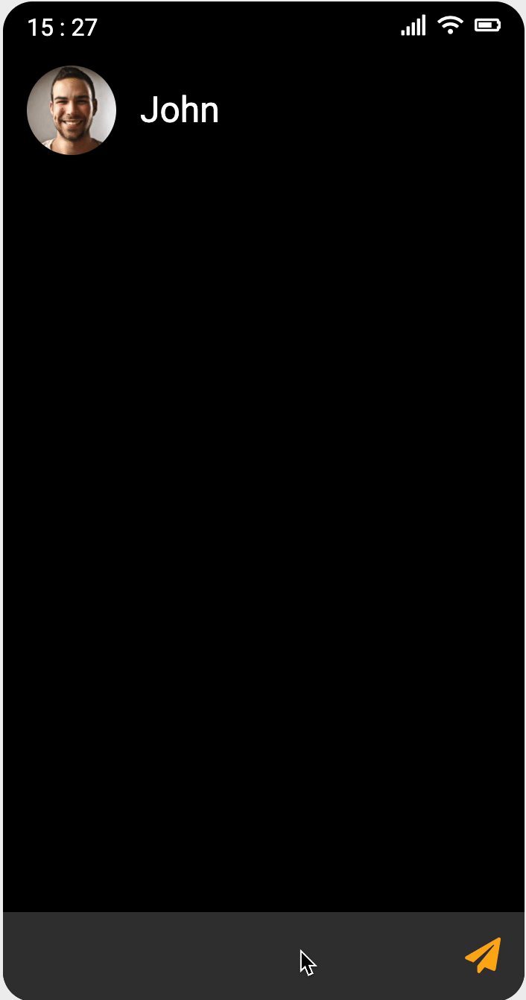

# 채팅하기

- ## 설명

  채팅창에 글을 쓰고 **전송 버튼** 또는 **엔터키**를 누르면

  준비되어있는 채팅이 응답하는 프로젝트입니다.

  \*\* 단, 채팅창에 내용이 없으면 내용이 보내지지 않도록 했습니다.

  

---

- 사용언어 : HTML, CSS, JavaScript

- 아이디어 및 이미지 소스 제공 : 드림코딩 by 엘리😊
